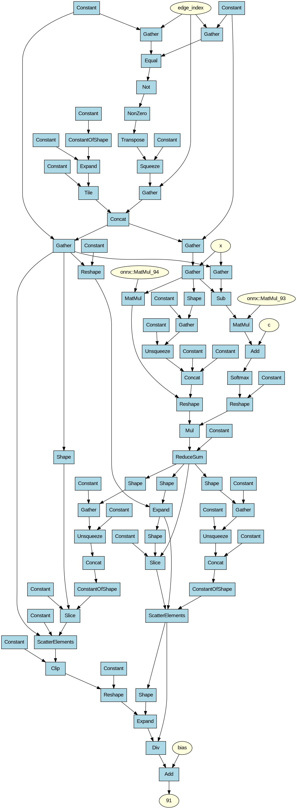

# NeuralGraph 

### About project
In this project, I implemented a Tensor Compiler frontend. It parses neural network models in **ONNX** format, constructs an internal Intermediate Representation (Data Flow Graph) consisting of nodes and tensors, and generates a Graphviz `.dot` file to visualize the network topology.

### Preparation (Linux)
You need to install **CMake**, **Protobuf**, and **Graphviz**.

```bash
sudo apt update
sudo apt install build-essential cmake
sudo apt install libprotobuf-dev protobuf-compiler
sudo apt install graphviz
```

### Run

#### Clone repository
```bash
git clone https://github.com/timbub/NeuralGraph.git
cd NeuralGraph
```

#### Build
```bash
cmake -DCMAKE_BUILD_TYPE=Release -S . -B build
cmake --build build
```

#### Run Compiler
The program takes two arguments: the path to the input `.onnx` model and the path where to save the output `.dot` file.

```bash
./build/neural_graph <*.onnx> <*.dot>
```

#### Generate Graph Image
To convert the generated `.dot` file into a PNG image, run the following command manually:

```bash
dot -Tpng <*.dot> -o graph.png
```

---

### Example Output

```
